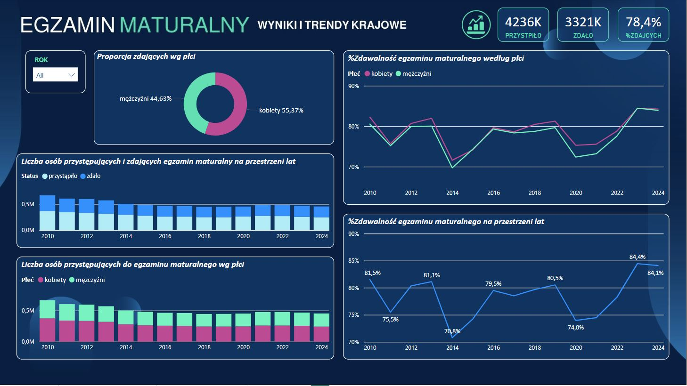
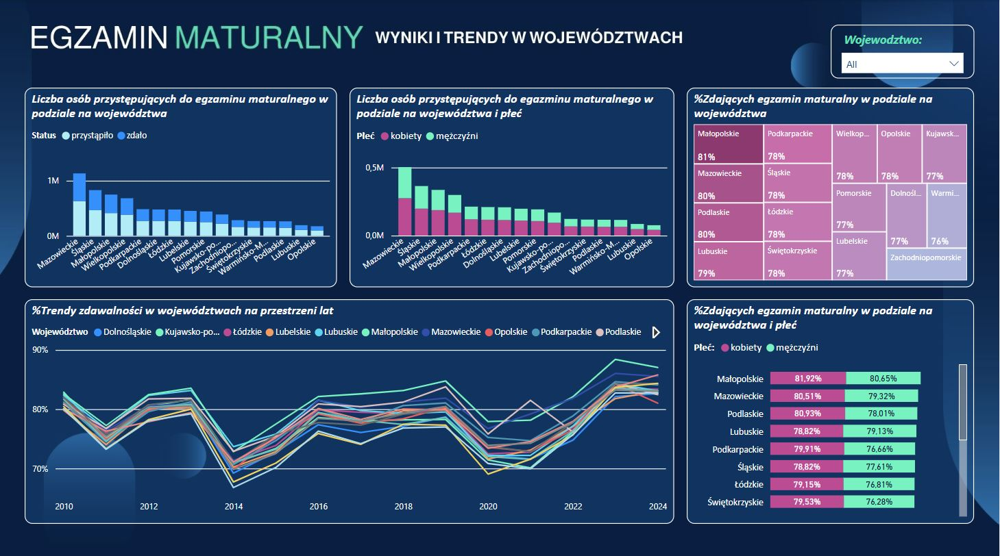
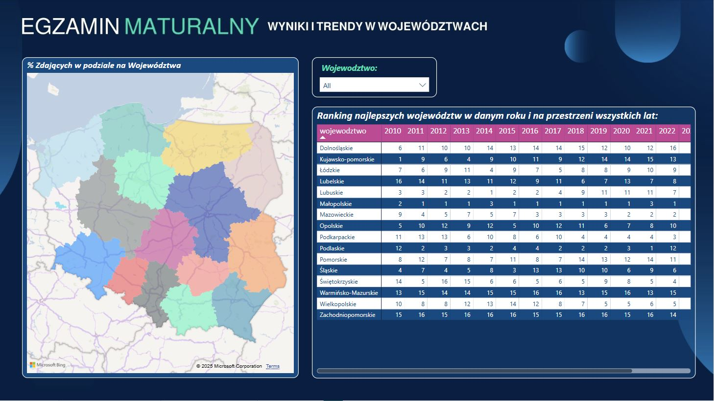

#### *Technical Skills: Excel, Power BI, Canva*
## Project Objective: 
The objective of the project is to visualize data and identify trends related to the number of candidates and the pass rate of the Matura exams (secondary school leaving examinations) in Poland over the past fourteen years. 
The analysis includes the presentation of results at the national level as well as a breakdown by voivodeships. 

## Dataset Involved:
The project is based on open data published by the Central Statistical Office of Poland. The dataset contains information on the number of people who took and passed the Matura exam.  

<B>*Data source:*</B> <a href="https://stat.gov.pl/obszary-tematyczne/edukacja/edukacja/liczba-osob-ktore-przystapilyzdaly-egzamin-maturalny,15,1.html">https://stat.gov.pl/obszary-tematyczne/edukacja/edukacja/liczba-osob-ktore-przystapilyzdaly-egzamin-maturalny,15,1.html</a>

## Data Visualization:
Below visuals have been made in Power BI desktop and describing results gathered from the dataset: 
*Matura Exams Country-level data insights:*

*Matura Exams Voivodeship-level data insights:*

*Ranking of Voivodeships with the best high school exam pass rates between 20210 - 2024:*

*Price Explorer:*

## Key Insights:
#### Country-level 
##### Dynamic Increase in Pass Rate After 2021 

After a decline in 2020-2021, the Matura exam pass rate significantly increased, reaching its highest level in 2024 (84.4%). This indicates the effectiveness of post-pandemic educational measures and potential changes in the exam format. 
##### Lowest Pass Rates in 2013 and 2021 

- The years 2013 (70.8%) and 2021 (74.0%) recorded the lowest pass rates, which may have been influenced by educational reforms, more difficult exam papers, or the pandemic. This demonstrates that specific factors can significantly impact exam results. 

##### Minimal Differences in Pass Rates Between Genders 

- Throughout all years, the pass rates for women and men remained at very similar levels. This suggests that gender is not a key factor in determining Matura exam results. 

##### Stabilization of the Number of Candidates Since 2016 

- After fluctuations between 2010 and 2016, the number of Matura candidates has remained relatively stable, indicating that the education system has achieved a certain demographic and organizational balance. 

##### Exceeding the 80% Threshold as a Measure of Success 

- In most years, the pass rate hovered around the 80% mark. Years in which results fell below this threshold were often associated with educational crises, while swift corrective actions led to improved outcomes.

#### Voivodeship-level 
##### Highest Pass Rate in Małopolskie 

- The Małopolskie Voivodeship recorded the highest Matura exam pass rate (81%) and the highest proportion of female candidates passing (81.92%). This may be attributed to a strong educational system, effective student preparation, and the high quality of secondary schools. 
##### Pass Rate Stability in High-Performing Regions 

- Mazowieckie (80%), Podkarpackie (78%), and Wielkopolskie (78%) consistently rank among the top regions for Matura pass rates over the years. This indicates that the quality of education in these voivodeships remains stable and resistant to systemic fluctuations. 

##### Lowest Pass Rates in Western and Northern Voivodeships 

- Regions such as Zachodniopomorskie (76%) and Warmińsko-Mazurskie (76%) report the lowest Matura pass rates. This could result from limited access to high-quality education, demographic challenges, or structural issues within the schooling system. 

##### Significant Disparities in Pass Rates Across Regions 

- The difference between the highest (Małopolskie – 81%) and lowest (Zachodniopomorskie – 76%) pass rates amounts to 5 percentage points. This highlights notable regional inequalities in education quality, which may require targeted interventions. 

##### Similar Trends in Pass Rate Changes Across All Voivodeships 

- Long-term trend analysis indicates that all regions experienced similar pass rate fluctuations—declines in 2013 and 2021, followed by increases after 2021. This suggests that nationwide changes in the education system, rather than solely regional factors, significantly influence Matura exam outcomes. 

  <!--## Download the project in .pdf-->

